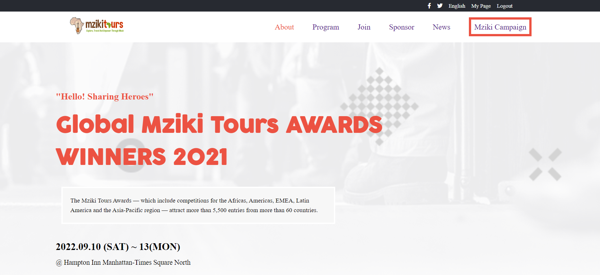
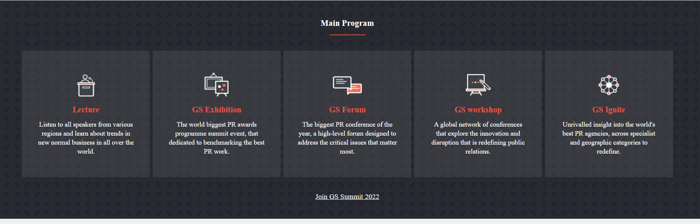
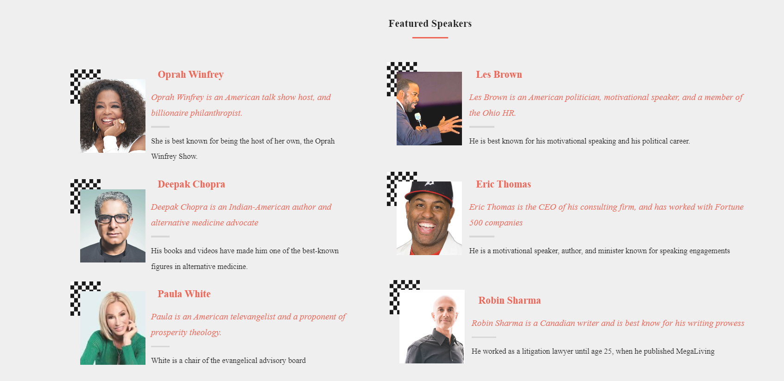

# Module1-Capstone-Project

"Mziki Tours App" is a web application that showcases music awards for best labels in a given year. A user can visit the website to identify which music label warn the award in a given year. Also, the app enlists the featured speakers for the program, therefore, making it easier for the user to relate with speeches from different speakers.

The present project is part of the Microverse curriculum Module 1 block 5 Capstone project. The main objective is putting hands on practice to build a web application using JavaScript, HTML/CSS, while using Behance design.





## Built With
* JavaScript
* HTML
* CSS

## Additional Tools

* Git
* Behance
* Stylelint
* Eslint

## Live Demo 

Live Application is found[Here](https://carshy.github.io/Module1-Capstone-Project/)

## Presentations

[By Musoko Collins](https://www.loom.com/share/5f825eca31794c6ba5bf3033514690f0)

## Getting Started

To get a local copy of this project:

Clone this repository or download the Zip folder:
```
https://github.com/Carshy/Module1-Capstone-Project.git
```
 
While in the project directory, you can run the live server

## Authors

👤 **Collins Musoko**

- GitHub: [@Github](https://github.com/Carshy)
- Twitter: [@Twitter](https://twitter.com/CarshyCollins)
- Linkedin: [Linkedin](https://www.linkedin.com/in/collins-musoko-864881120/)

## Show your support

Give a ⭐️ if you like this project!

## 🤝 Contributing

Contributions, issues, and feature requests are welcome!
Feel free to check the [issues page](https://github.com/Carshy/Module1-Capstone-Project/issues).

## Show your support

Give a ⭐️ if you like this project!

## Acknowledgments

- This project is part of week 1 of module 3 in the Microverse study program.
- Thanks to the Microverse team for the great curriculum 🙌.
- Thanks to Code Reviewers for the insightful feedback ⚡.
- A great thanks to My coding partners, morning session team, and standup team Partners for their contributions 💘.

## 📝 License

This project is [MIT](https://github.com/Carshy/readme-template/blob/master/MIT.md) licensed.